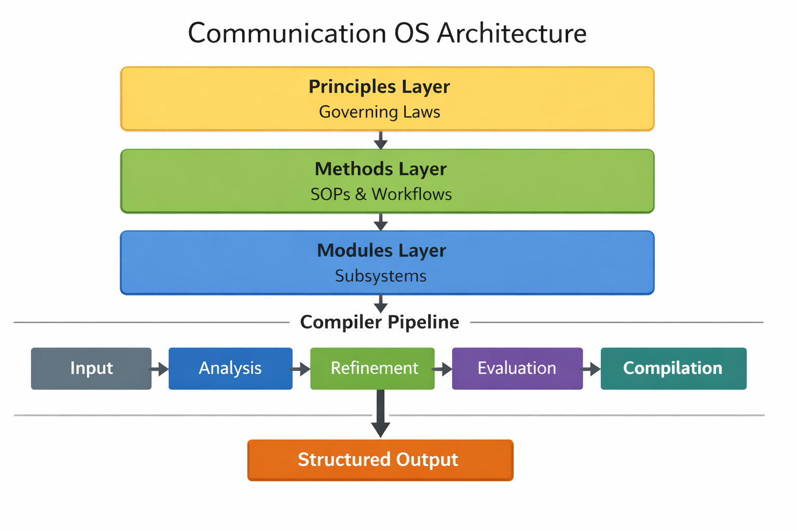
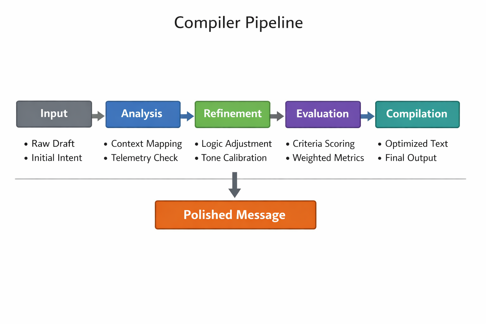

# Visual Diagrams

This directory contains all visual representations of the Communication OS architecture.

Below are the available diagrams:

---

## System Architecture Diagram

---

## Compiler Pipeline Diagram

---

## Module Interaction Diagram (Placeholder)
This placeholder will be replaced with a PNG once boosts refresh.

[View Placeholder](module-interaction-diagram.md)

---

## Evaluation Layer Diagram (Placeholder)
This placeholder will be replaced with a PNG once boosts refresh.

[View Placeholder](evaluation-layer-diagram.md)
